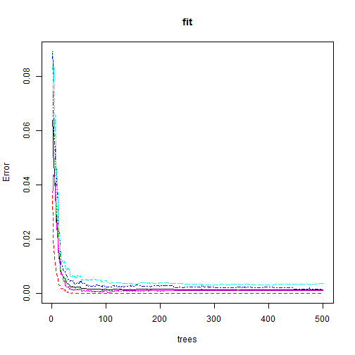

## Qualitative Activity Recognition of Weight Lifting Exercises  
### (Practical Machine Learning Assignment)  

## Synopsis   
I try to predict the manner in which they did the Weight Lifting Exercises[Human Activity Recognition](http://groupware.les.inf.puc-rio.br/har) and [original paper](http://groupware.les.inf.puc-rio.br/public/papers/2013.Velloso.QAR-WLE.pdf).  
I study a basic summary of the data (str(),cor(),boxplot()), then extract significant predictor variables and also exclude an outlier from [provided training dataset](https://d396qusza40orc.cloudfront.net/predmachlearn/pml-training.csv).  
I create model using Random Forest as original paper did and tuned it in ntree=100, mtry=p/3=18. The model shows excellent accuracy(0.999,almost equal to 1.0).  
Finally, I predict the manner for [provided test dataset](https://d396qusza40orc.cloudfront.net/predmachlearn/pml-testing.csv) and save them to the file according to the instruction of submission.  

## Data Processing  
1.load the Weight Lifting Exercises data  
  
2.extract significant predictor variables to analyse  
According to the result of str(),exclude user_name,raw_timestamp,cvtd_timestamp,new_window and statistic information about sensors because they have a lot of NA.  
PCA is not used here because I do not observe strong correlation among predictor variables and because PCA is useful for linear model.  
  
3.exclude outliers from the training dataset  
To specify the outliers data set seen in boxplot(), run summary() and find max/min of the variables. Only one outlier is found and excluded.  

```r
## 1.load the Weight Lifting Exercises data  

download.file("http://d396qusza40orc.cloudfront.net/predmachlearn/pml-training.csv","training.csv")  ## change "https" into "http" to mask error message from knitr
training_org <- read.csv("training.csv",header = TRUE) 
download.file("http://d396qusza40orc.cloudfront.net/predmachlearn/pml-testing.csv","testing.csv")  ## change "https" into "http" to mask error message from knitr
testing_org <- read.csv("testing.csv",header = TRUE)


## 2.extract significant predict variables to analyse   

## to see the overview of the data, run str(), but not show the result to save number of report pages  
## str(training_org)  

## according to the result of str(),exclude user_name,raw_timestamp,cvtd_timestamp,new_window and statistic information about sensors because they have a lot of NA   
column_training <- grep("^(num_window|roll|pitch|yaw|total|gyros|accel|magnet|classe)", names(training_org))
training_ana <- training_org[,column_training]
column_testing <- grep("^(num_window|roll|pitch|yaw|total|gyros|accel|magnet|problem_id)", names(testing_org))
testing_ana <- testing_org[,column_testing]

## to see the possibility of decreasing predictor variables, run cor(), but not show cor() result to save number of report pages 
## cor(training_ana[,-54]) >= 0.7    
## cor(training_ana[,-54]) <= -0.7
## according to the result of cor(), not see strong correlation among predictor variables

## PCA code below is just for studying purpose because PCA is useful for linear model
## the result shows 19 variables at 90%, 26 variables at 95% compared to original 53 variables
## prComp <- prcomp(training_ana[,-54],scale=T,center=T)
## summary(prComp)


## 3.exclude outliers for the training dataset   

boxplot(scale(training_ana[,-54]),main = "standarized value of each predictor variables", xlab = "predictor variables in column order ", ylab = "standarized value")
```

 

```r
## column 54 (classe) is response variable  

## to specify the outliers data set seen in boxplot(), run summary() and find max/min of the variables
## summary(training_ana)  
## not show the result to save report number of pages 
outliers <-(training_ana$gyros_dumbbell_x == min(training_ana$gyros_dumbbell_x)) | (training_ana$gyros_dumbbell_y == max(training_ana$gyros_dumbbell_y)) |     (training_ana$gyros_dumbbell_z == max(training_ana$gyros_dumbbell_z)) | (training_ana$gyros_forearm_x  == min(training_ana$gyros_forearm_x)) |                 (training_ana$gyros_forearm_y  == max(training_ana$gyros_forearm_y)) |(training_ana$gyros_forearm_z  == max(training_ana$gyros_forearm_z))

training_ana_exoutliers <- training_ana[-outliers,]
dim(training_ana);dim(training_ana_exoutliers)  ## observe only one outlier data
```

```
## [1] 19622    54
```

```
## [1] 19621    54
```
## Create model by the training data   
5.try Random Forest in default setting(ntree=500 and mtry=sqrt(p)) without cross-validation.     
 The result shows very low classification error(below 0.004) and OOB error (0.15%) and the performance on the plot becomes stable after ntree = 90.   
   
6.tune parameter(ntree and mtry) on cross validation data set (10 k-fold)     
 By the previous result, choose ntree =100 ( > 90 ).  
 After evaluation some mtry(sqrt(p),p/3,p/2,p), then choose mtry = p/3=18.  
 The result shows excellent classification accuracy(almost equal to 1.0).  

```r
## 5.try Random Forest in default setting(ntree=500 and mtry=sqrt(p)) without cross-validation  
library("caret")
p <- ncol(training_ana)-1   ## number of predictor variables
fit<-randomForest(classe~.,data=training_ana_exoutliers,ntree=500,mtry=ceiling(sqrt(p)))
fit
```

```
## 
## Call:
##  randomForest(formula = classe ~ ., data = training_ana_exoutliers,      ntree = 500, mtry = ceiling(sqrt(p))) 
##                Type of random forest: classification
##                      Number of trees: 500
## No. of variables tried at each split: 8
## 
##         OOB estimate of  error rate: 0.12%
## Confusion matrix:
##      A    B    C    D    E class.error
## A 5578    0    0    0    1   0.0001792
## B    3 3793    1    0    0   0.0010535
## C    0    6 3416    0    0   0.0017534
## D    0    0   10 3205    1   0.0034204
## E    0    0    0    2 3605   0.0005545
```

```r
plot(fit)
```

 

```r
## 6.tune parameter(ntree and mtry) on cross validation data set (10 k-fold)    
fitControl <- trainControl( method = "cv",  number = 10)  ## 10 k-fold
tGrid  <-  expand.grid(mtry= c(ceiling(sqrt(p)),ceiling(p/3),ceiling(p/2),p))
fittune<-train(classe~.,data=training_ana_exoutliers,method="rf",ntree=100,trControl = fitControl,tuneGrid = tGrid,trace=F)
fittune
```

```
## Random Forest 
## 
## 19621 samples
##    53 predictor
##     5 classes: 'A', 'B', 'C', 'D', 'E' 
## 
## No pre-processing
## Resampling: Cross-Validated (10 fold) 
## 
## Summary of sample sizes: 17659, 17657, 17658, 17659, 17660, 17659, ... 
## 
## Resampling results across tuning parameters:
## 
##   mtry  Accuracy  Kappa  Accuracy SD  Kappa SD
##    8    1         1      1e-03        0.001   
##   18    1         1      9e-04        0.001   
##   27    1         1      9e-04        0.001   
##   53    1         1      2e-03        0.002   
## 
## Accuracy was used to select the optimal model using  the largest value.
## The final value used for the model was mtry = 18.
```

## Predict the manner for the test data  
7.predict the manner for the test data on the tuned randomForest model  
 The final model shows classification accuracy(0.999) for training data.  
8.save the prediction result to the file according to the instruction of submission.

```r
## 7. predict the manner for the test data on the tuned randomForest model
fitControl <- trainControl( method = "cv",  number = 10)  ## 10 k-fold
tGrid  <-  expand.grid(mtry= c(ceiling(p/3)))
fitfinal<-train(classe~.,data=training_ana_exoutliers,method="rf",ntree=100,trControl = fitControl,tuneGrid = tGrid,trace=F)
fitfinal
```

```
## Random Forest 
## 
## 19621 samples
##    53 predictor
##     5 classes: 'A', 'B', 'C', 'D', 'E' 
## 
## No pre-processing
## Resampling: Cross-Validated (10 fold) 
## 
## Summary of sample sizes: 17659, 17659, 17660, 17660, 17658, 17660, ... 
## 
## Resampling results
## 
##   Accuracy  Kappa  Accuracy SD  Kappa SD
##   1         1      0.002        0.002   
## 
## Tuning parameter 'mtry' was held constant at a value of 18
## 
```

```r
fitfinal$results
```

```
##   mtry Accuracy  Kappa AccuracySD  KappaSD
## 1   18   0.9985 0.9981   0.001671 0.002113
```

```r
answers <-predict(fitfinal,testing_ana)  

## 8.save the prediction result to the file according to the instruction of submission   
pml_write_files = function(x){
     n = length(x)
     for(i in 1:n){
         filename = paste0("problem_id_",i,".txt")
         write.table(x[i],file=filename,quote=FALSE,row.names=FALSE,col.names=FALSE)
     }
 }
pml_write_files(answers)
```
